# Maven_Movies_Rental_DA
Data analysis of movies CD/DVD rental (transactions) and inventory

# Maven Movies Data Analysis: Enhancing Insights for a Rental Business

## Project Overview:
This project analyzes a movie rental business's database to provide actionable insights for improving operations, marketing strategies, and inventory management. The dataset is hosted in the MAVENMOVIES database, and SQL was extensively used for exploratory data analysis (EDA), schema understanding, and answering business-critical ad-hoc queries.

## Project Objectives:

### Customer Insights:

Identify customer details (names, emails) for targeted marketing campaigns.
Analyze customer rental patterns to improve customer engagement.

### Movie Inventory Analysis:

Explore the rental inventory and classify movies based on rental rates and availability.
Provide recommendations for expanding the movie collection based on popularity and rental rates.
Revenue Optimization:

Analyze rental rates to identify trends and the profitability of various pricing categories.
Determine the most rented movie categories and ratings to maximize revenue.

### Operational Efficiency:

Help track and manage movie inventory effectively.
Highlight gaps in the inventory and optimize stock levels.

# Tools & Library Used
 &nbsp;

# Project Result

[Click here to get full code](https://github.com/Kirteerathod/Maven_Movies_Rental_DA/blob/main/MOVIES_RENTAL_CODE.sql)

# Query Task

1. How can we extract the first name, last name, and email address of all customers to prepare a comprehensive contact list for the marketing team?
 
    &nbsp;

3. What is the total number of movies in the inventory that are available for rent at the lowest rental rate of $0.99?

     &nbsp;

5. How can we categorize all movies based on their rental rates and determine the count of movies in each category?

    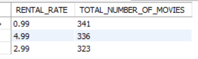 &nbsp;

7. Which movie rating (e.g., PG, PG-13, R) has the highest number of titles in the inventory, and how can this information help optimize inventory management?

   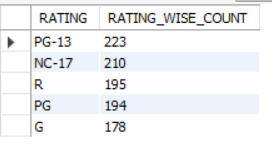 &nbsp;

8. What is the total count of PG-rated movies that have been rented, and what does this indicate about customer preferences?

   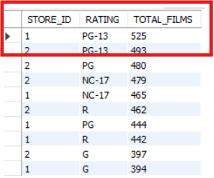 &nbsp;
  
6. What are the inventory IDs and corresponding film titles for movies that are currently rented out, and how can this data help track rental activity?

   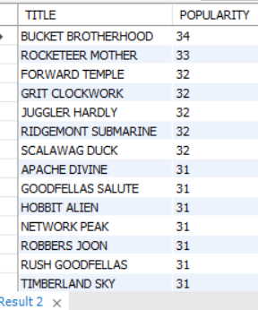 &nbsp;

7. List of films by filmname,category,language.

   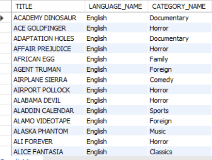 &nbsp;

8. Revenue Per film (top 10 grosser)

    &nbsp;

9. Which store has historically brought tye most revenue
    
   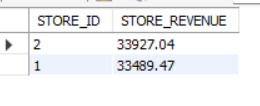 &nbsp;

11. How Many Rental We Have For Each Month

    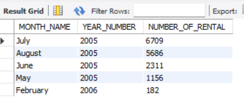 &nbsp;

12. Reward users who have rented at least 30 times (WITH DETAILS OF CUSTOMER)

   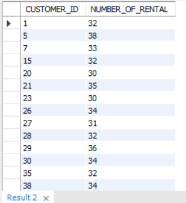 &nbsp;

12. Could you pull all payment from our first 100 customer (Based on customer_id)

     &nbsp;

14. Now, could you please write a query to pull all payments from those specific customers, along with payments over $5, from any customer?

    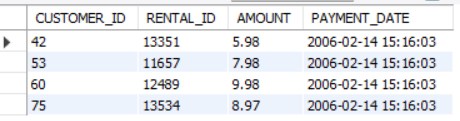 &nbsp;

15. We need to understand the special features in our films. Could you pull a list of films which include a Behind the Scenes special feature?  

     &nbsp;

16. unique movie ratings and number of movies

    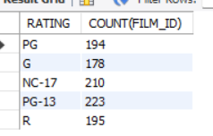 &nbsp;

17. Could you please pull a count of titles sliced by rental duration?

     &nbsp; 

18. I’m wondering if we charge more for a rental when the replacement cost is higher. Can you help me pull a count of films, along with the average, min, and max 
    rental rate,grouped by replacement cost?
    
     &nbsp; 

20. CATEGORIZING MOVIES TO RECOMMEND VARIOUS AGE GROUPS AND DEMOGRAPHIC
   
    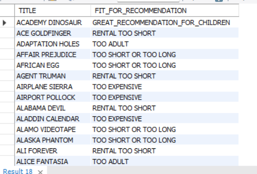 &nbsp; 

21. “I’d like to know which store each customer goes to, and whether or not they are active. Could you pull a list of first and last names of all customers, and
     label them as either ‘store 1 active’, ‘store 1 inactive’, ‘store 2 active’, or ‘store 2 inactive’?”   
      
     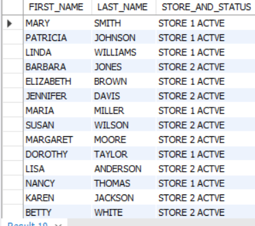 &nbsp;

22. “Can you pull for me a list of each film we have in inventory?I would like to see the film’s title, description, and the store_id value associated with each 
     item, and its inventory_id. Thanks!”

     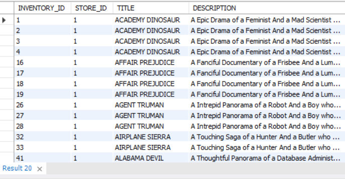 &nbsp;

23.  “One of our investors is interested in the films we carry and how many actors are listed for each
      film title. Can you pull a list of all titles, and figure out how many actors are associated with each title?”

      &nbsp;
     
24.  “Customers often ask which films their favorite actors appear in. It would be great to have a list of all actors, with each title that they appear in. Could 
      you please pull that for me?”

      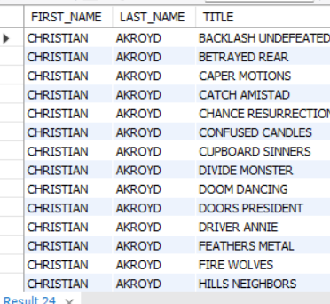 &nbsp;

25.  “The Manager from Store 2 is working on expanding our film collection there. Could you pull a list of distinct titles and their descriptions, currently 
      available in inventory at store 2?”
      
       &nbsp;

26.   “We will be hosting a meeting with all of our staff and advisors soon. Could you pull one list of all staff and advisor names, and include a column noting 
       whether they are a staff member or advisor? Thanks!”

      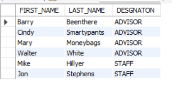 &nbsp;   
